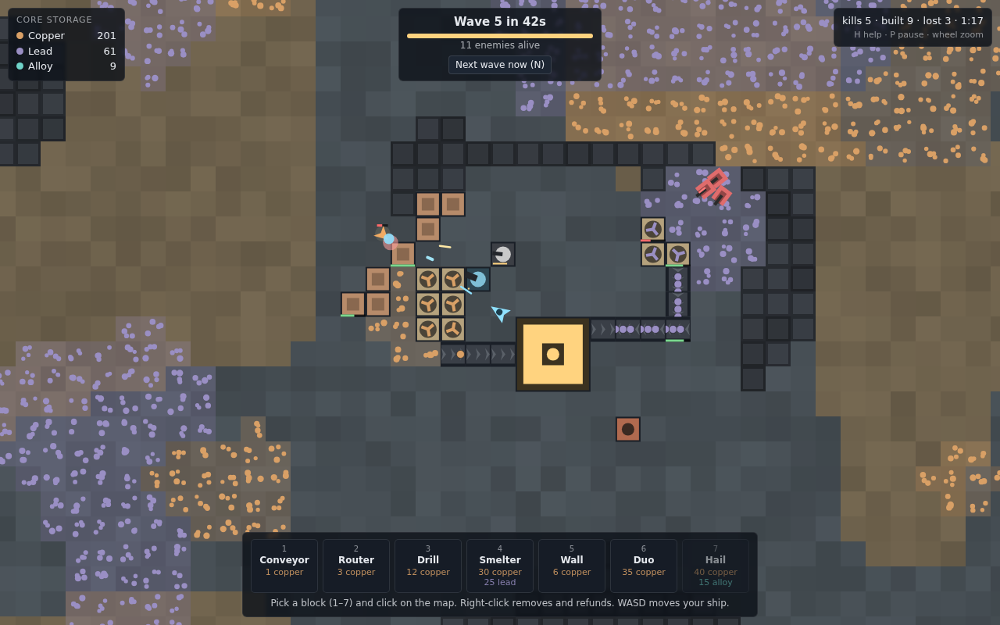

# A-Industry — gameplay proof of concept

A small, playable prototype of a Mindustry-style game: mine ore, move it with conveyors, spend it on
defenses, survive escalating enemy waves. The goal of this POC is to *feel* the core loop and find out which
parts of it are fun before committing to an engine, art style or tech stack.



## Running it

There is no build step and no dependency. Either open `index.html` directly in a browser, or serve the folder:

```
npx serve .          # or: python3 -m http.server 8000
```

Query parameters: `?seed=123` for a reproducible map, `&nohelp` to skip the intro overlay.

## The gameplay loop

1. **Mine.** Place drills on ore patches (copper, lead). A drill fills a small buffer and pushes items into
   any adjacent block that accepts them.
2. **Transport.** Conveyors carry items forward and feed whatever they point at. Routers split a line.
   Drag with the mouse to paint a belt that follows your cursor.
3. **Bank.** Everything that reaches the core is added to storage. Building costs are paid from the core.
4. **Defend.** Turrets need ammo delivered by belt: the Duo eats copper, the Hail eats alloy.
   Walls are cheap hit points. Your ship (WASD) auto-shoots and can only build within its range.
5. **Escalate.** A smelter turns 2 copper + 1 lead into alloy, which unlocks the Hail artillery.
   Waves grow every 50 s: more daggers, then fast flying flares from wave 4, tanky maces from wave 7.

Enemies enter at the red spawn markers and walk a Dijkstra flow field toward the core. Player buildings are
walkable but expensive in that field, so units route around a wall line when there is a short way around it
and chew through it when there is not. Units shoot whatever is closest: walls, drills, turrets, the core,
or your ship.

## Controls

| Input | Action |
| --- | --- |
| `W` `A` `S` `D` / arrows | fly the ship (it fires automatically at the nearest enemy) |
| `1`–`7` or toolbar | select a block |
| left click / drag | build (dragging a conveyor paints a path that turns with the cursor) |
| right click / drag | deconstruct, full refund |
| `R` or the ↻ Rotate tile | rotate conveyor |
| `X` or the ✕ Remove tile | remove mode: click or drag over blocks to deconstruct |
| `Q` / `Esc` | deselect |
| `N` | call the next wave now |
| `P` | pause, `H` help, mouse wheel zoom |

### Touch (phones and tablets)

The page detects a touch screen and switches to Mindustry's mobile scheme: the camera is free, the ship
flies where you tap, and building is tap or long-press-and-drag. The toolbar scrolls horizontally and the
`?`, `II`, `⛶` and `⌖` buttons replace the help, pause, fullscreen and "find my ship" keys.

| Gesture | Action |
| --- | --- |
| drag | pan the camera |
| pinch | zoom |
| tap empty ground | the ship flies there |
| tap a toolbar tile, then tap the map | build (if it is too far, the ship flies over; tap again when it arrives) |
| hold, then drag, with a block selected | paint a line (belts turn with your finger) |
| ✕ Remove, then tap or hold-and-drag over blocks | deconstruct, full refund |
| tap the selected tile again | deselect |

## Blocks and units

| Block | Cost | Role |
| --- | --- | --- |
| Conveyor | 1 copper | 2.4 tiles/s, 3 items per tile, never accepts head-on |
| Router | 3 copper | 1-item buffer, round-robins to neighbours except the source |
| Drill | 12 copper | needs ore under it, 1 item / 1.3 s (copper) or 1.9 s (lead) |
| Smelter | 30 copper, 25 lead | 2 copper + 1 lead → 1 alloy every 1.6 s |
| Wall | 6 copper | 420 hp |
| Duo | 35 copper | range 5.5, 9 dmg / 0.28 s, 1 copper = 5 shots |
| Hail | 40 copper, 15 alloy | range 9.5, 34 splash dmg / 1.3 s, 1 alloy = 3 shells |

| Unit | Hp | Notes |
| --- | --- | --- |
| Dagger | 70 | ground, stops to shoot at 2.8 tiles |
| Flare | 38 | flying, fast, ignores terrain, strafes while shooting |
| Mace | 360 | slow ground brawler, high damage |

Enemy hp scales by 12 % per wave. All numbers live in `src/config.js`.

## Code layout

Plain ES2020, HTML5 canvas, classic `<script>` tags so it runs from `file://`.

| File | Contents |
| --- | --- |
| `src/config.js` | every tunable: blocks, units, items, wave timing |
| `src/util.js` | seeded RNG, value noise, binary heap |
| `src/map.js` | procedural terrain and ore, spawn selection, flow field |
| `src/buildings.js` | block classes; items move with a push model (`tryGive(item, source)`) |
| `src/entities.js` | player ship, enemies, bullets |
| `src/game.js` | world state, placement rules, waves, fixed-step update |
| `src/render.js` | camera and all drawing; terrain is cached to an offscreen canvas |
| `src/input.js` | keyboard, mouse and touch via Pointer Events: drag-to-build, camera pan, tap-to-move, long-press lines, pinch zoom |
| `src/ui.js` | DOM HUD, toolbar, overlays |
| `src/main.js` | bootstrap and game loop, exposes `window.AIndustry` for scripting |

The simulation is deterministic per seed apart from wave composition shuffles and spawn jitter, and runs
at ~0.02 ms per 60 Hz step with a full base and 30 units, so there is plenty of headroom.

## What the POC tells us so far

Things that already feel right:

- Drag-painting conveyors is the central verb and it is satisfying even in this crude form.
- Turrets that need ammo by belt create a real logistics puzzle instead of "click to place defense".
- The build-range tether to the ship gives waves tension: you have to choose between fighting and building.
- Enemies attacking the nearest block makes walls meaningful without any special aggro rules.

Open questions worth exploring next, roughly in order of how much they would change the design:

1. **Power.** Mindustry's second resource system. A generator/battery/consumer layer would give crafters and
   strong turrets a second constraint. Easy to add to the push model (a power graph over adjacent nodes).
2. **Multi-tile blocks and bigger drills.** The core is 3×3 already; 2×2 drills covering several ore tiles
   change how patches are read on the map.
3. **Ore scarcity and map shape.** Current maps are 80×60 with ~13 % ore. Fewer, richer patches farther from
   the core would push the player to expand and defend supply lines, which is the fun part of the genre.
4. **Player agency in combat.** The ship only auto-fires. Manual aiming, or a mech with a build/shoot mode
   toggle, changes the feel a lot.
5. **Unloaders, bridges, junctions, sorters.** The logistics vocabulary that turns belts into puzzles.
6. **Research/tech tree and a campaign** are out of scope until the moment-to-moment loop is nailed down.

Known limitations: no save/load, no sound, no tutorial beyond the help overlay, enemy pathing recomputes at
most twice per second, bullets ignore rock.
